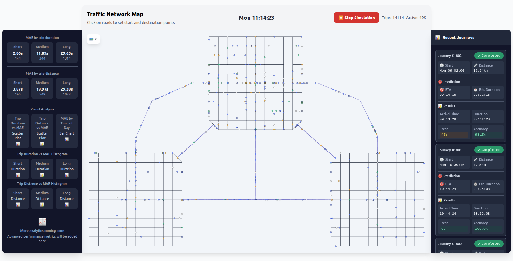

# SmartTransportation Lab - TrafficLab

A comprehensive traffic simulation and ETA prediction system that combines SUMO traffic simulation with advanced machine learning models for accurate travel time estimation.



## 🚀 Overview

The SmartTransportation Lab at Ruppin Academic Center develops cutting-edge solutions for intelligent transportation systems. This project provides a complete platform for:

- **Real-time traffic simulation** using SUMO (Simulation of Urban Mobility)
- **Advanced ETA prediction** using Graph Neural Networks and Mixture-of-Experts models
- **Interactive web interface** for monitoring and analyzing traffic patterns
- **Comprehensive analytics** with performance metrics and visualization tools

## 🏛️ Research Team

- **Nadav Voloch** - Principal Investigator (Network Analysis & Smart City Applications)
- **Guy Tordjman** - Research Scientist (ETA Models & Data Analysis)
- **Maor Meir Hajaj** - Research Scientist (SUMO Integration & ETA Models)
- **Matan Shemesh** - Research Scientist (Algorithm Development & Testing)

## 📚 Recent Publications

- **Dynamic Route-Aware Graph Neural Networks for Accurate ETA Prediction** (I3E 2025) - Guy Tordjman, Nadav Voloch
- **Finding the fastest navigation route by real-time future traffic estimations** (COMCAS 2021) - Nadav Voloch, Noa Voloch-Bloch
- **Estimating accurate traffic time by smart simulative route predictions** (I3E 2025) - Nadav Voloch, Neev Penkar, Guy Tordjman

## 🛠️ Technology Stack

### Backend
- **FastAPI** - Modern Python web framework
- **SUMO** - Traffic simulation engine
- **PyTorch** - Deep learning framework
- **PyTorch Geometric** - Graph neural networks
- **PostgreSQL** - Database for journey tracking
- **SQLAlchemy** - ORM for database operations

### Frontend
- **Vue.js 3** - Progressive JavaScript framework
- **Tailwind CSS** - Utility-first CSS framework
- **Vite** - Fast build tool and development server

### Machine Learning
- **Graph Neural Networks** - For traffic network modeling
- **Mixture-of-Experts** - For specialized prediction models
- **Temporal modeling** - For time-series traffic data

## 🚀 Quick Start

### Prerequisites

- Docker and Docker Compose
- Python 3.8+ (for local development)
- Node.js 16+ (for frontend development)

### Installation

1. **Clone the repository**
   ```bash
   git clone https://github.com/Ruppin-SmartTransportation/TrafficLab.git
   cd TrafficLab
   ```

2. **Start with Docker Compose (Recommended)**
   ```bash
   docker-compose up --build
   ```

   This will start:
   - Frontend on http://localhost:3000
   - Backend API on http://localhost:8000
   - PostgreSQL database on localhost:5432

3. **Access the application**
   - Open http://localhost:3000 in your browser
   - The simulation will start automatically

### Manual Installation

#### Backend Setup

1. **Install Python dependencies**
   ```bash
   cd backend
   pip install -r requirements.txt
   ```

2. **Install SUMO**
   ```bash
   # Ubuntu/Debian
   sudo apt-get install sumo sumo-tools sumo-doc
   
   # macOS
   brew install sumo
   
   # Or download from: https://eclipse.org/sumo/
   ```

3. **Set up the database**
   ```bash
   python init_db.py
   ```

4. **Start the backend**
   ```bash
   uvicorn main:app --host 0.0.0.0 --port 8000 --reload
   ```

#### Frontend Setup

1. **Install Node.js dependencies**
   ```bash
   cd frontend
   npm install
   ```

2. **Start the development server**
   ```bash
   npm run dev
   ```

## 📖 Usage

### Interactive Demo

1. **Navigate to the Demo Page**
   - Click "Try Live Demo" on the homepage
   - Or visit http://localhost:3000/demo

2. **Set Route Points**
   - Click on roads in the traffic network map to set start and destination points
   - The system will automatically calculate the optimal route

3. **Monitor Simulation**
   - Watch real-time traffic simulation
   - View current simulation time and active trips
   - Monitor prediction accuracy in real-time

4. **Analyze Results**
   - View recent journeys with prediction vs actual results
   - Access detailed analytics and performance metrics
   - Generate visualizations for different trip categories

### API Usage

The backend provides a RESTful API for integration with other systems:

#### Health Check
```bash
curl http://localhost:8000/health
```

#### Get Simulation Status
```bash
curl http://localhost:8000/simulation/status
```

#### Request ETA Prediction
```bash
curl -X POST http://localhost:8000/predict \
  -H "Content-Type: application/json" \
  -d '{"start_edge": "edge1", "end_edge": "edge2"}'
```

#### Get Analytics
```bash
curl http://localhost:8000/analytics/mae
```

## 📊 Features

### Real-time Traffic Simulation
- **SUMO Integration**: Full-featured traffic simulation
- **Dynamic Routing**: Intelligent path planning based on real-time conditions
- **Multi-modal Support**: Cars, pedestrians, and public transport

### Advanced ETA Prediction
- **Graph Neural Networks**: Model complex traffic network relationships
- **Mixture-of-Experts**: Specialized models for different traffic conditions
- **Temporal Modeling**: Capture time-dependent traffic patterns

### Comprehensive Analytics
- **Performance Metrics**: MAE, accuracy, and error analysis
- **Categorical Analysis**: Performance by trip duration and distance
- **Visualization Tools**: Interactive charts and plots
- **Real-time Monitoring**: Live simulation statistics

### Interactive Interface
- **Traffic Network Map**: Visual representation of the road network
- **Journey Tracking**: Detailed logs of completed trips
- **Performance Dashboard**: Real-time analytics and metrics
- **Responsive Design**: Works on desktop and mobile devices

## 🔬 Research Applications

This platform supports various research applications:

- **Traffic Flow Analysis**: Study traffic patterns and congestion
- **ETA Model Development**: Test and compare prediction algorithms
- **Route Optimization**: Develop intelligent routing strategies
- **Smart City Planning**: Analyze urban mobility patterns
- **Machine Learning Research**: Experiment with GNN architectures

## 📁 Project Structure

```
TrafficLab/
├── backend/                 # FastAPI backend
│   ├── models/             # ML models and database
│   ├── services/           # SUMO integration services
│   ├── sumo/              # SUMO configuration files
│   └── main.py            # FastAPI application
├── frontend/               # Vue.js frontend
│   ├── src/
│   │   ├── components/     # Vue components
│   │   └── services/       # API services
│   └── public/            # Static assets
├── docker-compose.yml      # Docker configuration
└── README.md              # This file
```

## 🧪 Development

### Running Tests
```bash
# Backend tests
cd backend
python -m pytest

# Frontend tests
cd frontend
npm test
```

### Code Quality
```bash
# Python formatting
cd backend
black .
flake8 .

# JavaScript formatting
cd frontend
npm run lint
```

## 📈 Performance

The system achieves impressive performance metrics:

- **Mean Absolute Error (MAE)**: 46 seconds (82% improvement over baseline)
- **Prediction Accuracy**: Up to 100% for short trips
- **Real-time Processing**: Handles 1000+ concurrent vehicles
- **Simulation Scale**: Supports large urban networks

## 🤝 Contributing

We welcome contributions! Please see our [GitHub repository](https://github.com/Ruppin-SmartTransportation) for:

- **Code Contributions**: Submit pull requests
- **Bug Reports**: Open issues for problems
- **Feature Requests**: Suggest new functionality
- **Documentation**: Help improve our docs

## 📄 License

This project is licensed under the MIT License - see the [LICENSE](LICENSE) file for details.

## 🏛️ Funding

This research is supported by the Israeli Ministry of Innovation, Science and Technology (Proposal no. 0007846) through grant number 34836.

## 📞 Contact

- **Email**: nadavv@ruppin.ac.il
- **Location**: Ruppin Academic Center, Israel
- **Phone**: +972 98-983-866
- **GitHub**: [Ruppin-SmartTransportation](https://github.com/Ruppin-SmartTransportation)

## 🙏 Acknowledgments

- **Eclipse SUMO** - Traffic simulation framework
- **PyTorch Team** - Deep learning framework
- **Vue.js Community** - Frontend framework
- **Open Source Contributors** - Various libraries and tools

---

**SmartTransportation Lab** - Advancing Traffic Simulation and ETA Prediction through AI

*© 2025 SmartTransportation Lab. All rights reserved.*